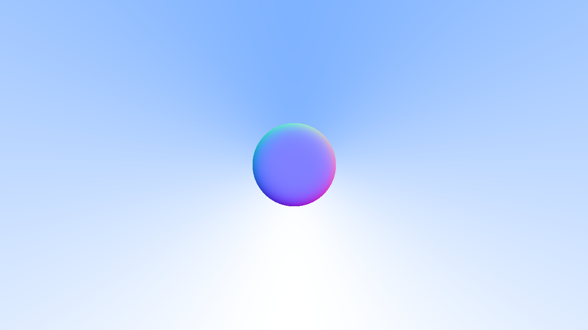
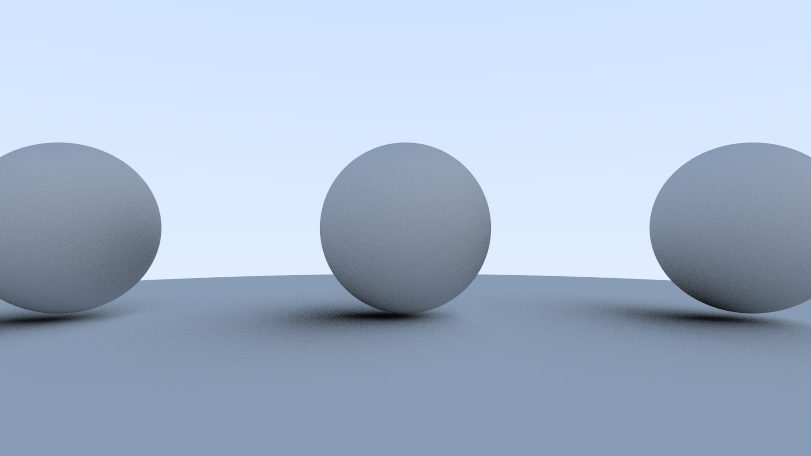

# Ray Tracing
Based on the book [Ray Tracing in One Weekend](https://raytracing.github.io/books/RayTracingInOneWeekend.html)
For the theory behind the renders and example code, see the link above.

## Pretty Renders I've Made
- The first render output, in a `.ppm` file
  - `.ppm` files store `RGB` values that go from left to right, top to bottom
  - This image has a constant blue value, red increases from left-right, green decreases from top-bottom  
  
- A simple gradient
  - By ray-tracing, we can pick a value for each pixel by getting the y-component of the direction vector of the ray
  - We can colour this with more "blue" the higher up the ray points  
  
- A circle (a sphere?)
  - We can render objects on the screen too by adding objects to the 3D environment
  - If we add a sphere to the environment, we can change the colour of pixels depending on if the ray intersects with the 3D object
  - We can also add an outline by checking if the intersection is near the edge
  - The result is a circle that represents a sphere
  
- Normals colouring
  - We can give this sphere a bit more character by colouring it
  - One approach is to map the normal vector at the point of collision between the ray and the sphere's surface to a colour  
  
- More spheres
  - We can abstract the sphere object and render more spheres
  - Here's 3 spheres on top of a big sphere:
  
- Anti-Aliasing
  - We can fix the jagged edges of the sphere by tracing more rays per pixel
  - We pick points close to the ray and average them together to generate anti-aliased renders
  - Light AA (Not as many rays per pixel):
    
  - Medium AA (More rays per pixel, smoother):
    
  - Heavy AA (Even more rays per pixel, almost blurry edges):
    
- Diffuse materials
  - We can model light bounces from our spheres to simulate light in real life
  - For diffuse materials, light bounces randomly with a probability distribution, generating a "matte" look
  - We simulate multiple light bounces per pixel and average them out to get this:
  
  - Gamma correction can be applied to correct the overly dark spheres:
    
  - We can also use different probability distributions to model light bounces
  - Heres a lambertian reflectance sphere:
    
    - Note: At this point a slight error is made in my renders where the co-ordinate system of the shadows is slightly off, leading to left-skewing shadows
      - This is fixed later on
- Metals
  - Metals reflect light in a more direct way, we can trace these reflected rays to get metals now  
  
  - We can also make metals that aren't fully reflective by only reflecting rays directly some of the time, and reflecting them randomly other times
    
- Glass
  - We can use light refraction properties to generate spheres that exhibit glass-like behaviour too
  
  - We can also render hollow spheres:
    
